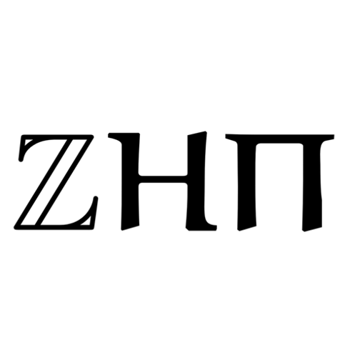

= Zhetapi ℤHΠ
:sectnums:
:toc2:

# Introduction


Zhetapi (ℤHΠ) is a C++ (14) computation library that was built in the hopes of
making mathematical computation and algorithmic research more convenient to the
users.

This project is being developed in a Linux environment and has only been tested
for it. It is a work in progress.

# Features

## Evaluation of Complex Expressions

The library can evaluate complex expressions, which have operands of various
types, such as integers, rational numbers, complex numbers, vectors and
matrices.

Through the RTTI mechanism of C++, the framework of the library allows the
evaluation to be sensitive to certain types of operands and their corresponding
operations. For example, multiplication of two integers yields an integer, the
division of two rational numbers stays rational, and the product of a matrix,
whose components are integers, with a rational scalar, yields a matrix with
rational components.

The `expression.h` header contains `expr()` and `exprf()`, which return
the value of the passed expression as a string. The difference in these two lies
in the fact that `exprf()` takes in a formatted string, while `expr()`
takes a string object.

```{cpp}
// Not formatted, prints "1.0"
cout << expr("1 + 2!/2.0") << endl;

// Formatted, also prints "1.0"
cout << exprf("%d + %d!/2.0", 1, 2) << endl;
```

## Usage and Declaration of Variables

The library provides constructs that allow the user to store variables and
retrieve them in the scope of the `Barn` class. Users can then refer to these
variables, and their values can be retrieved or changed.

```{cpp}
Variable <double> x{"x", 46};

Barn <double, int> brn;

brn.add(x);

// Prints "[x] - 46"
cout << brn.get("x") << endl;

// Generates an exception
cout << brn.get("y") << endl;
```

## User Defined Functions

Users can create mathematical functions, which can then be used as any other C++
functor object.

```{cpp}
Function <double, int> f = "f(x) = x^2";

// Prints "10"
cout << f(10) << endl;

// Prints "9/16"
cout << f(Rational <int> {3, 4}) << endl;

// Prints "25.0"
cout << f(5.0) << endl;
```

## Calculus

An object of class `Function` can be differentiated in terms of any of its
variables, to get its gradients and such. This process is symbolic, which has
the advantage that one has a closed form for the derivative, but the
disadvantage that it could be very complicated.

```{cpp}
Function <double, int> f = "f(x) = x^2";

// Compute df/dx
Function <double, int> df = f.derivative();

// Prints "f(x) = x^2"
cout << f << endl;

// Prints "df/dx(x) = 2x"
cout << df << endl;

// Prints "df/dx(2) = 4" twice
cout << "df/dx(2) = " << f.differentiate(2) << endl;
cout << "df/dx(2) = " << df(2) << endl;
```

## Code Generation and Dynamically Optimizing Functions

In addition to being able to define and use functions, the user can generate
source code for the function using the `Function::generate_general` method.
The user should note that the code generated still uses the Zhetapi API.

```{cpp}
Function <double, int> f = "f(x) = x^2 + x * ln(x)";

// Generates the source code for
// f in the file __gen_f.cpp
f.generate_general();
```

For the example function above, the source code generated would look like the
following:

```{cpp}
#include <token.hpp>
#include <function.hpp>

extern "C" {
	zhetapi::Barn <double, int> __gen_f_barn;

	zhetapi::token *__gen_f(zhetapi::token *in1)
	{
		zhetapi::token *c1 = new zhetapi::operand <int> (2);
		zhetapi::token *inter1 = __gen_f_barn.compute("^", {in1, c1});
		zhetapi::token *inter2 = __gen_f_barn.compute("ln", {in1});
		zhetapi::token *inter3 = __gen_f_barn.compute("*", {in1, inter2});
		zhetapi::token *inter4 = __gen_f_barn.compute("+", {inter1, inter3});
		return inter4;
	}
}
```

The user can also dynamically compile these generated files using the
`Function::compile_general` method:

```{cpp}
// Initialize the Function object
Function <double, int> fx = "f(x) = x^2 + x * ln(x)";

// Prints "123.026"
cout << fx(10)->str() << endl;

// Cast the generated function
typedef token *(*ftr)(token *);

ftr gfx = (ftr) fx.compile_general();

// Allocate the operands
token *opd = new operand <int> (10);

// Also prints "123.026"
cout << gfx(opd)->str() << endl;

// Free resources
delete opd;
```

The method returns a pointer to the compiled and linked function, which the user
should then cast to use. Note that because of the usage of the Zhetapi API in
the generated source code, the user must pass pointers to tokens as operands of
the casted function. It is guaranteed, however, that the pointers passed to the
generated functions are not modified in any way. Thus, the user is responsible
for freeing the memory allocated for performed the computations.

The advantage of using the generated function is that it carries less overhead
in computations when compared to objects of the `Function` class.

## Linear Algebra

The library also provides ways in which the user can do linear algebra. The
classes `Vector` and `Matrix` come with a variety of methods on their own, which
include performing computation as well as manipulation of their representations.

In addition to these classes, the library provides standard algorithms such as Gram
Schmidt and LU Factorization (see below).

## Standard Algorithms

|===

| Function | Description | Engine Header

| `gram_schmidt` | Performs the Gram Schmidt process on the given
set of vectors.	| `algorithm.h`

| `gram_schmidt_normalized` | Same as `gram_schmidt` but returns a basis of
normalized vectors. | `algorithm.h`

| `lagrange_interpolate` | Performs Lagrange interpolation on the given set of
points. Returns the appropriate polynomial. | `algorithm.h`

| `lu_factorize` | Returns the LU factorization of a matrix. | `algorithm.h`

| `solve_linear_equation` | Solves the linear equation `Ax = b` given `A` and
`b`. | `algorithm.h`

| `reduced_polynomial_fitting` | Returns a polynomial that goes through the
given set of points. Differs from `lagrange_interpolate` in that it returns a
simplified polynomial. | `algorithm.h`

| `gradient_descent` | Applies gradient descent to a given function on the given
set of data. | `algorithm.h`

| `find_root` | Uses Newton's method to find the root of the given function. |
`algorithm.h`

| `solve_hlde_constant` | Solves the homogeneous linear differential equation
with constant coefficients represented by the given polynomial. Returns a list
of functions as a basis to the solution space. | `calculus.h`

| `bernoulli_sequence_real` | Generates the first `n` terms of the Bernoulli
sequence. | `combinatorial.h`

| `bernoulli_sequence_rational` | Generates the first `n` terms of the Bernoulli
sequence as rational numbers. | `combinatorial.h`

| `bernoulli_number_real` | Generates the `n` th Bernoulli number.
| `combinatorial.h`

| `bernoulli_number_rational` | Generates the `n` th Bernoulli number as a
rational number.
| `combinatorial.h`

|===

# Overview of Usable Classes

Below are the currently usable classes.

|===

| Class Name | Description | Engine Header

| `Activation` | An activation in the standard machine learning context | `activations.hpp`
| `Barn` | A class which contains settings for other classes like functions | `rational.hpp`
| `Complex` | A complex number in mathematics | `complex.hpp`
| `Function` | A mathematical function | `function.hpp`
| `Matrix` | A matrix in linear algebra | `matrix.hpp`
| `Network` | A deep neural network in machine learning | `network.hpp`
| `Optimizer` | A class which computes costs, in the standard machine learning
context | `optimizer.hpp`
| `Polynomial` | A polynomial in algebra | `polynomial.hpp`
| `Rational` | A rational number in algebra | `rational.hpp`
| `Tensor` | Represents a tensor in algebra | `tensor.hpp`
| `Vector` | A vector in linear algebra | `vector.hpp`

|===


# Modules

A description of each directory is presented below:

|===

| Directory | Description

| cli |	Code for the Command Line Interface (CLI) application of Zhetapi. The
CLI will allow the user to directly compute expressions and declare functions
from the command line -- it is essentially a calculator application like `octave`.

| engine | Contains the library template headers. All library features are
present in this module. It will later contain API functions.

| inc | Contains the source used in library template headers, and which are
optional to include. Includes code that is not meant to be seen by the users.

| tests | Resources used to test library features.

| texifier | Code to convert plain text math to Latex. Used on the website to
turn results from plain text into Latex.

| web | Code to run the web server for the Zhetapi website. This website
supports the computation of mathematical expressions and it also provides graphing
capabilities. This is still in early development.

|===

# Usage

All applications headers use the `g++-8` compiler and Boost 1.65.1 (Spirit, Phoenix and
Fusion).

## Zhetapi CLI

The Zhetapi CLI is a command-line calculator application, similar to GNU Octave, with additional abilities to store variables and define functions. The user can also enter special commands, by using a `#` before specifying the command name (ie. the `#list` command lists all available commands).

To install the CLI (Unix systems only), change to the `zhetapi` directory and run `. ./install.sh` (run `chmod +x install.sh` if necessary). The command will build the CLI and make the command globally available.

To exit the CLI, simply enter `#q` or `#quit` from the CLi or terminate the program with `Ctrl-C`.

# What Next?

## Simplification of Functions

Currently, objects of the `Function` class lack the complete ability to simplify
their representations. Some of this functionality does already exist, such as
the fact that adding/subtracting by 0 and multiplying/dividing by 1 are trivial
actions.

As an example that is not yet featured, it is not yet possible to have the
object recognize that `3xy + 5yx` is the same as `8xy`. This feature would also
help reduce the complexity of derivates of these objects.

## Integration and Differentiation

Symbolic differentiation is a current feature. However, integration is not. This
feature will be implemented as soon as the current framework has been properly
placed. The addition of other kinds of differentiation and integration, such as
automatic differentiation, and different types of numerical integration
(quadrature, etc.), is also something to look forward to.

## Exact Forms of Numbers

One recognizes, simply by looking at the first few digits, that the number
`3.141592` is most nearly pi, and that the number `2.7182817` is most nearly
Euler's number. The hope is that at some point, the library will be able to
reach similar conclusions, through the help of integer relations algorithms such
as PSLQ.

## More Algorithms in Linear Algebra

Although there are a few standard linear algebra algorithms, the hope is that
more will be added. These include QR factorization, SVD, diagonalization, etc.

## Machine Learning

A solid foundation for linear algebra is already present in the library. The
next move would be to implement machine learning utilities, such as Deep Neural
Networks.

## Native Code Generation

The library already can generate, compile and link `Function`
objects in runtime. However, as mentioned, the source generated uses the Zhetapi
API. This is disadvantageous in that it takes much longer to compile than native
programs, and the user also has the added responsibility of managing the
resources for the computation of the generated function.

The next step is to generate source code natively, using only native types that
the user specifies. The only library functions that should be used are those in
any of the headers in the `inc/std` directory (for example, if the function uses
the binomial coefficient, then the source would include the
`std_combinatorial.hpp` header).

## Improve Semantics

The library aims to allow the user to perform mathematical tasks with
ease. Thus, the notational convenience of library features is important and is a
task that remains to be seen through.

# References

Below is a list of resources used in the making of this project.

 . Strang, Gilbert. _Introduction to Linear Algebra._ Wellesley, MA: Cambridge Press, 2016. Print.
 . Apostol, Tom M. _Calculus. Volume I_ New York: J. Wiley, 1967. Print.
 . Apostol, Tom M. _Calculus. Volume II_ Waltham, Mass: Blaisdell Pub. Co, 1967. Print.
 . Graham, Ronald L., Donald E. Knuth, and Oren Patashnik. _Concrete Mathematics
 : A Foundation For Computer Science._ Reading, Mass: Addison-Wesley, 1994. Print.
 . Stroustrup, Bjarne. _The C++ Programming Language._ Upper Saddle River, NJ: Addison-Wesley, 2013. Print.
 . Press, William H., et al. _Numerical Recipes : The Art of Scientific Computing._ Cambridge, UK New York: Cambridge University Press, 2007. Print.
